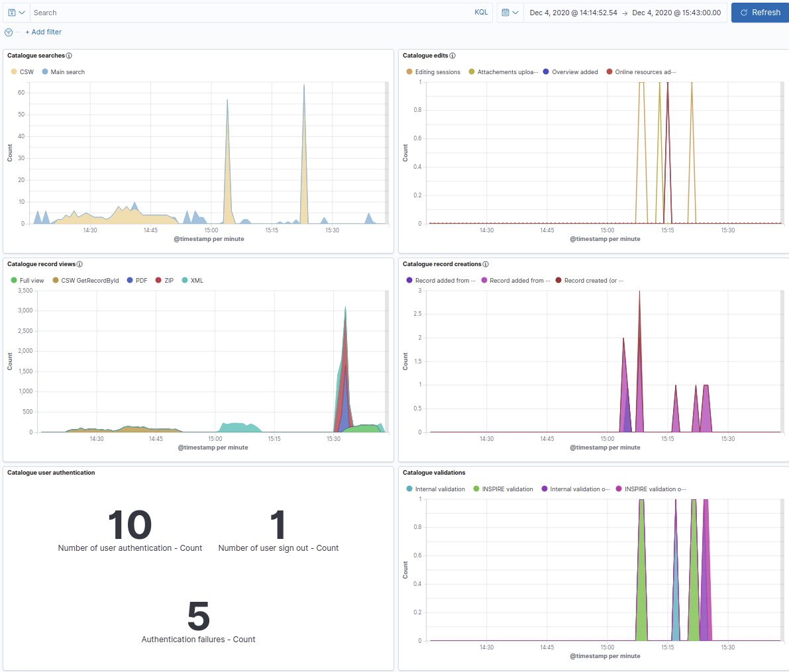

# Version 4.2.5

## Running with integrated Elasticsearch

1. Clone this repository

```shell script
git clone https://github.com/geonetwork/docker-geonetwork.git
cd docker-geonetwork/4.2.5
```

2. Run the docker-composition from the current directory:

```shell script
docker-compose up
```

3. Open http://localhost:8080/geonetwork/ in a browser


## Build docker image

If not published, you can build the image locally using:

```shell script
docker build .
```

## Running with remote Elasticsearch


```shell script
docker run -p 8080:8080 \
-e "GEONETWORK_DB_NAME=/tmp/gndb" \
-e "ES_HOST=my-elasticsearch-host" \
-e "ES_PORT=9200" \
-e "ES_PROTOCOL=http" \
-e "ES_INDEX_RECORDS=gn-records" \
-e "KB_URL=http://my-kibana-host:5601" \
geonetwork:4.2.5
```

If you have error connecting to the remote Elasticsearch, check the configuration in `config/elasticsearch.yml`:

```yaml
network.host: my-elasticsearch-host
discovery.seed_hosts: []
```


## Running with custom geonetwork.war


This directory includes two Dockerfiles:
* `Dockerfile` is canonical one used to generate the Docker Hub official 
image. It downloads GeoNetwork 4.2.5-0 WAR file from sourceforge.  
* `Dockerfile.local` needs a `geonetwork.war` file next to it to build
the image.

It also includes two docker-compose configuration files.
* `docker-compose.yml` uses official GeoNetwork image from Docker Hub.
* `docker-compose.dev.yml` can be applied to override the image used in 
`docker-compose.yml` and build the GeoNetwork image using `Dockerfile.local`.


### Pre-built image

To use the pre-built image you can use the `docker-compose.yml` file provided 
in this directory:

```shell script
docker-compose up 
```

### Local image

To be able to generate an elasticsearch-ready docker image, you will have:

1. Build your geonetwork.war (https://geonetwork-opensource.org/manuals/trunk/en/maintainer-guide/installing/installing-from-source-code.html#the-quick-way)

2. Clone this repository

```shell script
git clone https://github.com/geonetwork/docker-geonetwork.git
cd docker-geonetwork/4.2.5
```

3. Get the generated webapp in the current directory, name it `geonetwork.war`

```shell
cp ../../core-geonetwork/web/target/geonetwork.war .
```

4. Run the docker-composition from the current directory:

```shell script
docker-compose -f docker-compose.yml -f docker-compose.dev.yml up --build
```

5. Open http://localhost:8080/geonetwork/ in a browser

## Database configuration

See "Connecting to a postgres database" https://hub.docker.com/_/geonetwork


```shell script
docker run --name geonetwork -d -p 8080:8080 \
-e GEONETWORK_DB_TYPE=postgres \
-e GEONETWORK_DB_HOST=my-db-host \
-e GEONETWORK_DB_PORT=5434 \
-e GEONETWORK_DB_USERNAME=postgres  \
-e GEONETWORK_DB_PASSWORD=mysecretpassword \
-e GEONETWORK_DB_NAME=mydbname \
geonetwork:4.2.5
```


## Monitoring

A composition is also available for monitoring metrics and logs 
for the webserver and the database. 

First start the composition without monitoring containers.
In Kibana go to `Manage space` and create a `catalogue-monitor` space.
This space will be populated with default dashboards by metricbeat and filebeat.

Once the space created, use the following to start metricbeat and filebeat:

```shell script
docker-compose -f docker-compose.yml  -f docker-compose.monitoring.yml up --build 
```

Metricbeat and filebeat needs to authenticate to push into Kibana (GeoNetwork is checking access). Adapt password
 if needed in configuration files for `setup.kibana.username` and `setup.kibana.password`. 

Once started, sample dashboards analyzing the GeoNetwork API usage are available in `catalogue-log-dashboard.ndjson`.


