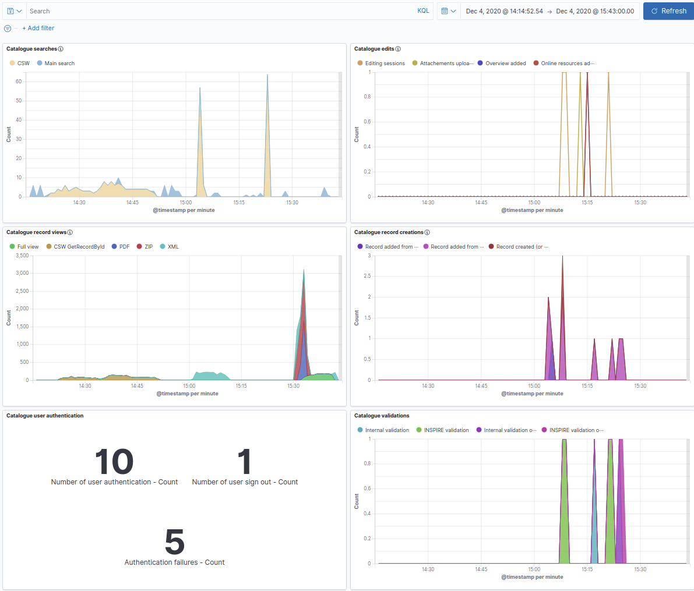

# Version 4.4.0

## Running with integrated Elasticsearch

1. Clone this repository

```shell script
git clone https://github.com/geonetwork/docker-geonetwork.git
cd docker-geonetwork/4.4.0
```

2. Run the docker-composition from the current directory:

```shell script
docker-compose up
```

3. Open http://localhost:8080/geonetwork/ in a browser


## Build docker image

If not published, you can build the image locally using:

```shell script
docker build .
```

## Running with custom geonetwork.war


This directory includes two Dockerfiles:
* `Dockerfile` is canonical one used to generate the Docker Hub official 
image. It downloads GeoNetwork 4.4.0-0 WAR file from sourceforge.  
* `Dockerfile.local` needs a `geonetwork.war` file next to it to build
the image.

It also includes two docker-compose configuration files.
* `docker-compose.yml` uses official GeoNetwork image from Docker Hub.
* `docker-compose.dev.yml` can be applied to override the image used in 
`docker-compose.yml` and build the GeoNetwork image using `Dockerfile.local`.


### Pre-built image

To use the pre-built image you can use the `docker-compose.yml` file provided 
in this directory:

```shell script
docker-compose up 
```

### Local image

To be able to generate an elasticsearch-ready docker image, you will have:

1. Build your geonetwork.war (https://geonetwork-opensource.org/manuals/trunk/en/maintainer-guide/installing/installing-from-source-code.html#the-quick-way)

2. Clone this repository

```shell script
git clone https://github.com/geonetwork/docker-geonetwork.git
cd docker-geonetwork/4.4.0
```

3. Get the generated webapp in the current directory, name it `geonetwork.war`

```shell
cp ../../core-geonetwork/web/target/geonetwork.war .
```

4. Run the docker-composition from the current directory:

```shell script
docker-compose -f docker-compose.yml -f docker-compose.dev.yml up --build
```

5. Open http://localhost:8080/geonetwork/ in a browser

## Running with a custom Database

See "Connecting to a postgres database" https://hub.docker.com/_/geonetwork


```shell script
docker run --name geonetwork -d -p 8080:8080 \
           -e GEONETWORK_DB_TYPE=postgres \
           -e GEONETWORK_DB_HOST=my-db-host \
           -e GEONETWORK_DB_PORT=5434 \
           -e GEONETWORK_DB_USERNAME=postgres  \
           -e GEONETWORK_DB_PASSWORD=mysecretpassword \
           -e GEONETWORK_DB_NAME=mydbname \
           geonetwork:4.4.0
```

## Running with remote Elasticsearch

```shell script
docker run --name geonetwork -d -p 8080:8080 \
       -e "GN_CONFIG_PROPERTIES=-Des.host=elasticsearch \
          -Des.protocol=http \
          -Des.port=9200 \
          -Des.url=http://elasticsearch:9200 \
          -Dgeonetwork.ESFeaturesProxy.targetUri=http://elasticsearch:9200/gn-features/{_} " \
       geonetwork:4.4.0
```

If you have error connecting to the remote Elasticsearch, check the configuration in `config/elasticsearch.yml`:

```yaml
network.host: my-elasticsearch-host
discovery.seed_hosts: []
```

## Running with custom Elasticsearch index names

Add the following options to `GN_CONFIG_PROPERTIES`:

```
-Des.index.records=geo-records 
-Des.index.features=geo-features 
-Des.index.searchlogs=geo-searchlogs 
-Dgeonetwork.ESFeaturesProxy.targetUri=http://elasticsearch:9200/geo-features/{_}
```


## Running with remote Elasticsearch with authentication

Add the `-Des.username=esUserName -Des.password=esPassword` options to `GN_CONFIG_PROPERTIES`.

If using the WFS features harvesting, add the
`-Dgeonetwork.ESFeaturesProxy.username=esReadOnlyUsername -Dgeonetwork.ESFeaturesProxy.password=esPassword` options to `GN_CONFIG_PROPERTIES`.


## Running with remote Kibana

Add the `-Dgeonetwork.HttpDashboardProxy.targetUri=http://kibana:5601` options to `GN_CONFIG_PROPERTIES`.


## Running with remote OGC API Records

Add the `-Dgeonetwork.MicroServicesProxy.targetUri=http://ogc-api-records-service:8080` options to `GN_CONFIG_PROPERTIES`.


## Running with custom security mode

Add the `-Dgeonetwork.security.type=` to set the authentication mode. See available security modes in https://github.com/geonetwork/core-geonetwork/blob/main/web/src/main/webapp/WEB-INF/config-security/config-security.xml#L43-L64 and configuration options in https://github.com/geonetwork/core-geonetwork/blob/main/web/src/main/webapp/WEB-INF/config-security/config-security.properties. See also https://geonetwork-opensource.org/manuals/4.0.x/en/administrator-guide/managing-users-and-groups/authentication-mode.html.


eg. LDAP configuration:
```
-Dgeonetwork.security.type=ldap
-Dldap.host=ldap
-Dldap.port=389
-Dldap.base=dc=geonetwork-opensource,dc=org
-Dldap.base.dn=dc=geonetwork-opensource,dc=org
-Dldap.security.principal=cn=admin,dc=geonetwork-opensource,dc=org
-Dldap.security.credentials=secret
-Dldap.base.search.base=ou=directory
-Dldap.sync.user.search.base=ou=directory
-Dldap.base.dn.pattern=uid={0},ou=directory
```

eg. CAS configuration
```
-Dcas.baseURL=http://localhost:8080/cas
-Dcas.login.url=http://localhost:8080/cas/login
-Dcas.ticket.validator.url=http://cas:8080/cas
-Dgeonetwork.https.url=http://localhost:8080/geonetwork
```


## Running with a custom context path

To run the application in a custom context path, for example in http://localhost:8080/catalogue instead of the default http://localhost:8080/geonetwork use the `WEBAPP_CONTEXT_PATH` environment variable:
```yaml
  environment:
    WEBAPP_CONTEXT_PATH: /catalogue
```
## Configure the default language

To configure the default application language and bypass browser language detection when redirecting from the base URL use: 

```
-Dlanguage.default=fre
-Dlanguage.forceDefault=true
```


## Monitoring

A composition is also available for monitoring metrics and logs 
for the webserver and the database. 

First start the composition without monitoring containers.
In Kibana go to `Manage space` and create a `catalogue-monitor` space.
This space will be populated with default dashboards by metricbeat and filebeat.

Once the space created, use the following to start metricbeat and filebeat:

```shell script
docker-compose -f docker-compose.yml  -f docker-compose.monitoring.yml up --build 
```

Metricbeat and filebeat needs to authenticate to push into Kibana (GeoNetwork is checking access). Adapt password
 if needed in configuration files for `setup.kibana.username` and `setup.kibana.password`. 

Once started, sample dashboards analyzing the GeoNetwork API usage are available in `catalogue-log-dashboard.ndjson`.


